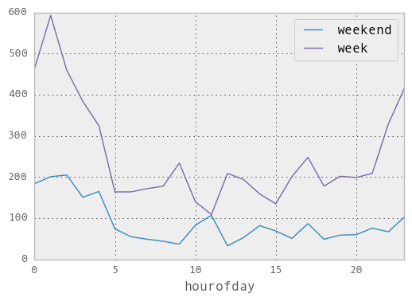

## Data Processing
The data after 2013 does not have medallion or hack license information so it is hard to answer questions such as trips that actually went from LGA to Astoria to Mahattan. Also winter months might have lower numebrs. Thus I have selected 201308 data. And because this data does not have location id. I have used python libraries
shapely and rtree to process the data with shapefile to find out if the point is within the polygon and return the polygonid(location id), referencing code from [page](http://rexdouglass.com/fast-spatial-joins-in-python-with-a-spatial-index). For detailed data processing code , please see [here](https://github.com/ying4uang/rides/blob/master/nyctaxi-data%20processing.ipynb).
For detailed data analysis code , please click [here](https://github.com/ying4uang/rides/blob/master/nyctaxi-data%20analysis.ipynb).

Becasue the file is relatively large - greater than 2GB, I have decided to split it into 4 subfiles using 'split' command and process them separately to add the location id. In the end, I merged result with 'cat' and perform analysis on the final result with pandas.

Location id reference:

Astoria 7

Uppereast 256,257

La Guardia 138


### Q1. efficiency of within Astoria. From Astoria to Manhattan. From LaGuardia airport, through Astoria, to Manhattan and back.

We can see for Aug 2013, the average passenger per ride is about 1.66. Average cab can sit around 3-4 person so the occupancy is actually low.

In terms of trips originating from Astoria, we have a lot more trips than the rides that began and ended Astoria. The total trips are 33723, about 8 times the number for trips within Astoria. The occupancy is about the same, around 1.7 passengers per ride.

The trip for LaGuardia Airport(LGA) to Astoria and then to Manhattan is a bit more complicated. The 2013 Aug data is already 2GB. For performance I am only selecting out trips that originated or ended either in LGA, Astoria, Uppereast(north or south, which is according to location id 236,237 on the lookup data on nyc taxi site). Out of this dataset, to find the taxis that went through this route, I did the following steps:

-  filter out data that only originates from LGA and Astoria
	
	```
	df_license = df[df.pu_location_id.isin([138,7])]
	
	```
- do a self join on the dataset and find out the connected trips that picked up in LGA and dropped off in astoria, joining on trip date and hack license and also making sure dropoff time in Astoria is earlier than the pickup time of the next trip. The caveate of this is that the 2 trips might be too far apart.

	```
	df_merged =df_license.merge(df_license, 
	left_on = ['hack_license','do_location_id','trip_date'],
	right_on =['hack_license','pu_location_id','trip_date'])
	df_astoria_do = df_merged[(df_merged.pu_location_id_x==138) 
	& (df_merged.do_location_id_x==7) 
	& (df_merged.dropoff_datetime_x<df_merged.pickup_datetime_y)]

	
	```
So I have found 359 trips out of total trips that actually went from LGA to Astoria to Uppereast. There will be likely be more if more locations in Mahattan are included in the dataset.




### Q1. How does this compare to our current area of service (e.g. the Upper East Side)?


We can see for Aug 2013, the average passenger per ride is about 1.66. Average cab can sit around 3-4 person so the occupancy is actually low.

The trips within upper east are a lot higher than those just originating  from Astoria, in total 137434 rides. The efficiency is lower as there is only 1.62 passenger per ride




### Q2 Would you provide rides only within Astoria for this new service or also between Astoria and Manhattan? Why?

I would provide rides between Astoria and Mahattan. The main reason being that volume is not as high for trips within Astoria. However, the traffic is not as bad as in Mahattan so we would be able to complete more rides.


### Q3 Hours of Operations for Astoria

I would launch on rush hours on weekdays. The weekend traffic is generally lower. However, the weekend late hour traffic is higher. In addition. there is an advantage that there is less traffic so we could complete more rides. I would be cautious because people usually have safety concerns late night calling shared rides service.

	df_astoria['pickup_datetime'] = pd.to_datetime(df_astoria['pickup_datetime'], format='%Y-%m-%d %H:%M:%S') 
	df_astoria['weekday'] = df_astoria['pickup_datetime'].apply(lambda x: x.weekday())
	df_astoria['hourofday'] =  df_astoria['pickup_datetime'].apply(lambda x: x.hour)
	df_astoria.groupby(['weekday', 'hourofday'])['passenger_count'].count()
	plot_weekend = df_astoria[df_astoria.weekday.isin([6,0])].groupby(['hourofday'])['passenger_count'].sum()
	plot_weekdays = df_astoria[~df_astoria.weekday.isin([6,0])].groupby(['hourofday'])['passenger_count'].sum()
	plot_weekend.plot(x='hourofday', y='passenger_count', label='weekend',legend='true')
	plot_weekdays.plot(x='hourofday', y='passenger_count', label='week',legend='true')
	






I would launch on rush hours on weekdays. The weekend traffic is generally lower. However, the weekend late hour traffic is higher. In addition. there is an advantage that there is less traffic so we could complete more rides. I would be cautious because people usually have safety concerns late night calling shared rides service.


### Qualitative

### additional data
We can look at Uber dataset as well since there might be a big overlap in customers that are used to shared ride services. I would look at their rides data by day and hour and see if the trend stays the same. So with $5 per ride and paying drivers 30-40 a day with 10% commission means we need 3-4 rides with at least 2 people to cover just the driver salary. In addition there are other costs such as insurance coverage and platform. I have looked at this [article](http://www.crainsnewyork.com/article/20150524/TRANSPORTATION/150529933/yet-another-ride-service-only-this-one-is-different) that we need ""between six and eight rides per hour to turn a profit." If we are going from airport to Mahattan we might not be able to fit as many rides in an hour since LGA to Mahattan takes around 30-40min alone. Thus picking up someone from Astoria might be a better idea. 


### How might your answer change over time? What data would you monitor to measure effectiveness?

With LaGuardia in construction now, it would be interesting to see the traffic change. I would also monitor the number of rides by time, looking at how many rides were completed and with how many passengers. I would also monitor weather and holiday/event traffic to take into account the impact on sharing. There is also constant changes in terms of regulations.



